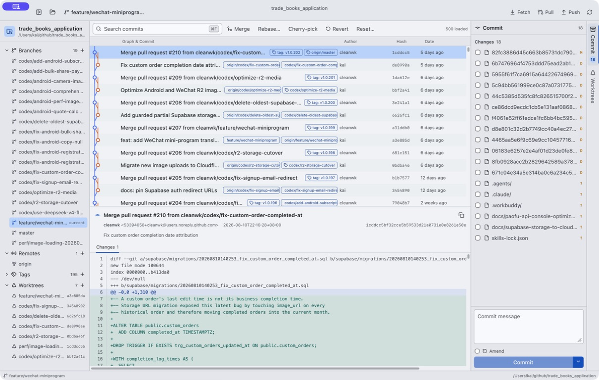
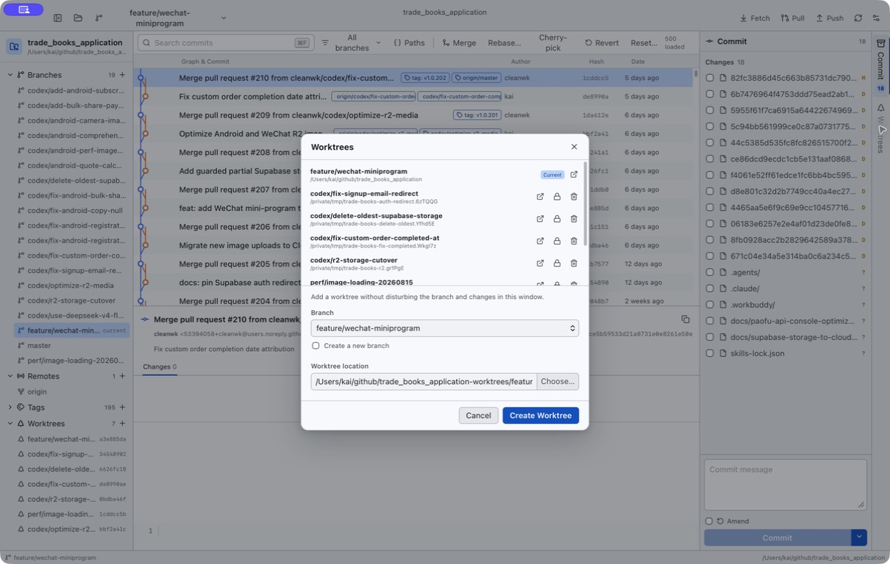
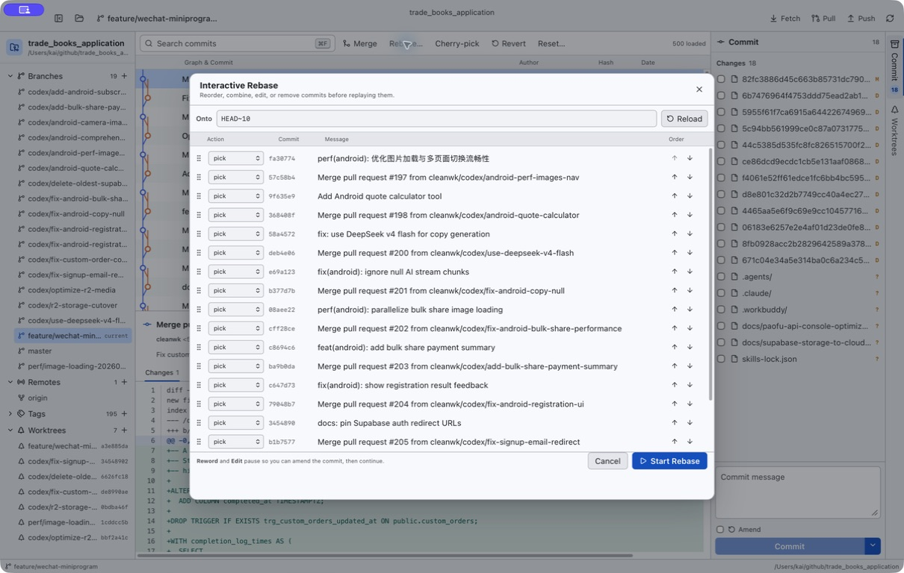

<div align="center">
  
  <h1>Graft</h1>
  <p><strong>A precise, fast Git client for macOS.</strong></p>
  <p>
    <a href="https://github.com/cleanwk/graft/actions/workflows/ci.yml"></a>
    <a href="https://github.com/cleanwk/graft/releases/latest"></a>
    
    <a href="LICENSE-MIT"></a>
  </p>
  <p>Rust + Tauri + Vue, powered by the Git you already trust.</p>
</div>



> [!WARNING]
> Graft is an early **Beta**. Back up important work, review destructive Git operations carefully, and expect the interface and storage formats to evolve.

Graft brings the dense, keyboard-oriented Git workflow of IntelliJ IDEA into a focused native macOS application. It delegates repository semantics to the system `git` executable, preserving your hooks, signing, credential helpers, SSH configuration, and familiar command behavior.

## Install

Graft currently supports **Apple silicon** and **macOS 26 Tahoe or newer**.

```sh
brew install --cask cleanwk/tap/graft
```

Upgrade or remove the Homebrew-managed application with:

```sh
brew upgrade --cask --greedy graft
brew uninstall --cask graft
```

Or download the DMG from [GitHub Releases](https://github.com/cleanwk/graft/releases/latest).

The current Beta uses a hardened-runtime ad-hoc signature. Until Developer ID signing and Apple notarization are enabled, macOS may require you to confirm the first launch from **System Settings → Privacy & Security**. Do not disable Gatekeeper globally.

Graft checks GitHub Releases when it starts. When a signed update is available, choose **Update & Restart** to install it in place—there is no need to download and reinstall the DMG for every version. Homebrew users can also run `brew upgrade --cask --greedy graft`.

## What works today

- Virtualized, paged commit graph tested against a repository with 524,408 commits
- Commit details, patches, whole-file staging, and individual hunk staging
- Commit, amend, fetch, pull, push, branch, tag, and remote workflows
- Merge, cherry-pick, revert, reset, and interactive rebase
- Three-way conflict resolution with continue and abort controls
- First-class worktrees: create, open, lock, unlock, remove, and prune
- Native repository watching and multi-window worktree navigation
- No telemetry

<table>
  <tr>
    <td></td>
    <td></td>
  </tr>
  <tr>
    <td align="center"><sub>First-class worktrees</sub></td>
    <td align="center"><sub>Interactive rebase planning</sub></td>
  </tr>
</table>

## Development

Requirements: macOS 26+, Apple silicon, Xcode Command Line Tools, Rust 1.92+, and Node.js 24+.

```sh
npm ci
npm run app:dev
```

Run the full local suite with:

```sh
npm run check
cargo clippy --manifest-path src-tauri/Cargo.toml --all-targets -- -D warnings
```

Build the application and DMG with `npm run app:build`.

## Versioning and releases

Graft follows semantic versioning. While the project is in early Beta, releases remain in the `0.x` line. A single command synchronizes the npm package, lockfile, Cargo package, and Tauri bundle versions:

```sh
npm run version:set -- 0.0.2
```

After committing the version change, push a matching tag such as `v0.0.2`. GitHub Actions verifies the manifests, builds the Apple silicon app and DMG, signs updater artifacts, publishes `latest.json`, and updates `cleanwk/homebrew-tap`.

Updater signing keys and Apple signing credentials are stored only as GitHub Actions secrets. See the [release acceptance report](docs/acceptance/2026-08-15-release.md) for the verified feature and performance baseline.

## Roadmap to stable

- Developer ID signing and Apple notarization
- Broader real-world Beta testing and crash hardening
- Accessibility and keyboard-navigation polish
- Submission to the official `Homebrew/homebrew-cask` repository, enabling `brew install --cask graft`

## License

Licensed under either [Apache License 2.0](LICENSE-APACHE) or [MIT](LICENSE-MIT), at your option.
